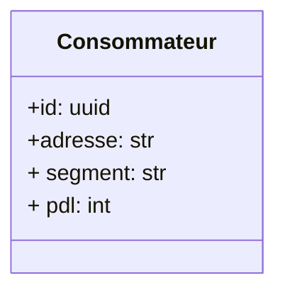
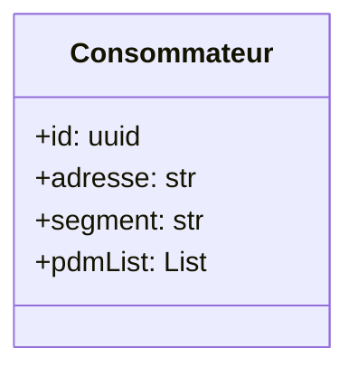
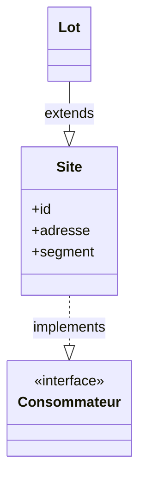
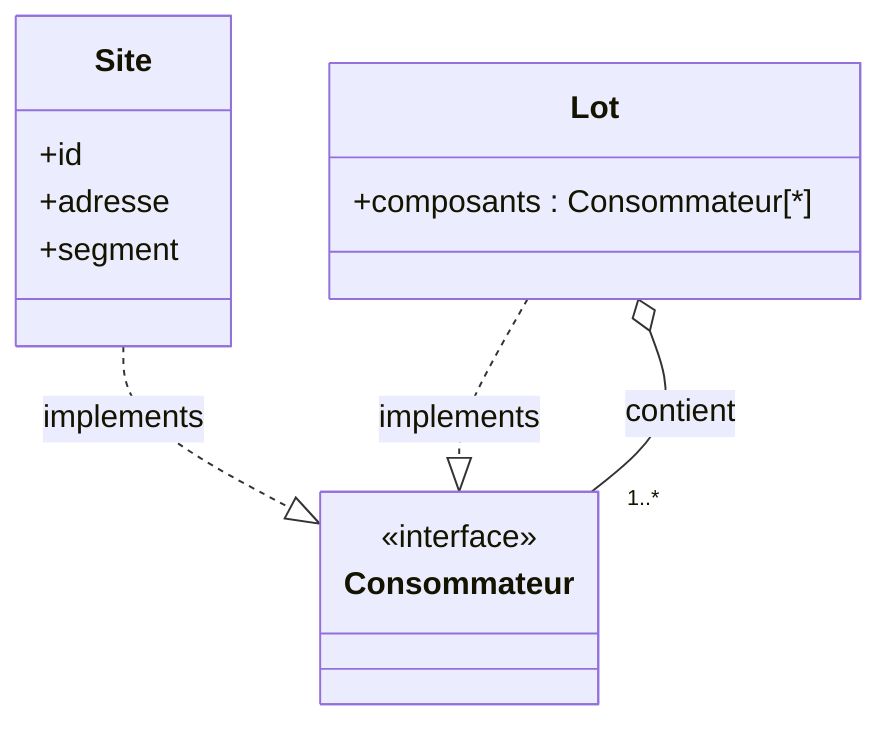

# Composite

Lorsque l'on modèlise un système de consommation d'énérgie, nous avons besoin de savoir ce qu'est un consommateur. Il est composé d'une addresse, d'un segement (désigne donc une catégorie de consommateurs d’électricité ) et en France on l'identifie grace à un numéro appelé le PDL (Point de livraison).

Puis un jour, le système s'est complexifié, on nous a demandé d'intégrer une notion de groupe de consomatteur. Permettant d'aggréer plusieurs PDL.

La première idée qui nous eu fut de changer le PDL en liste de PDL dans notre modèle.

Or ceci ne fonctionne que si le segment est le même. Dans la plupart des cas cela est correct mais certaines fois ce n'est pas le cas.

Nous avons donc opté pour une nouvelle modélisation. Nous avons donc des site des lieux qui consomme de l'électricité puis des Lot qui hérite et qui contiennent les numéros de compteur

Mais est-ce que ça a du sens ?
Si on s'ancre dans le réel. Un maison pourrait elle hérité d'un immeuble ? ça n'a pas de sens. Cette modélisation n'a donc pas de sens.

C'est la où le pattern composite va venir nous aider.

En prenant l'exemple de la maison, pourrait on regrouper plusieurs maisons ensemble ? Oui ça s'appelle un lotissement, et si on les places à la verticale ça s'appelle des appartements d'un immeuble.

En utilisant le pattern composite nous arrivons à cette modélisation :

