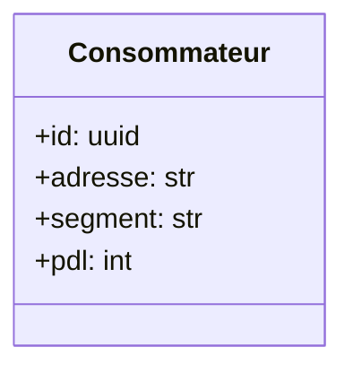
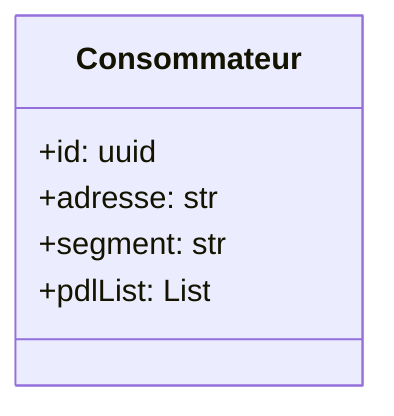
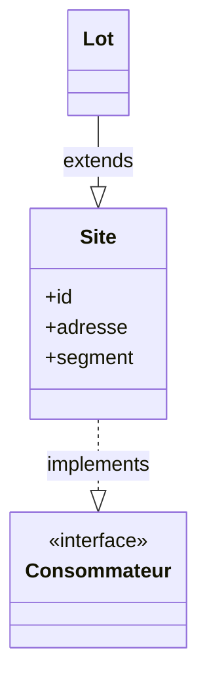
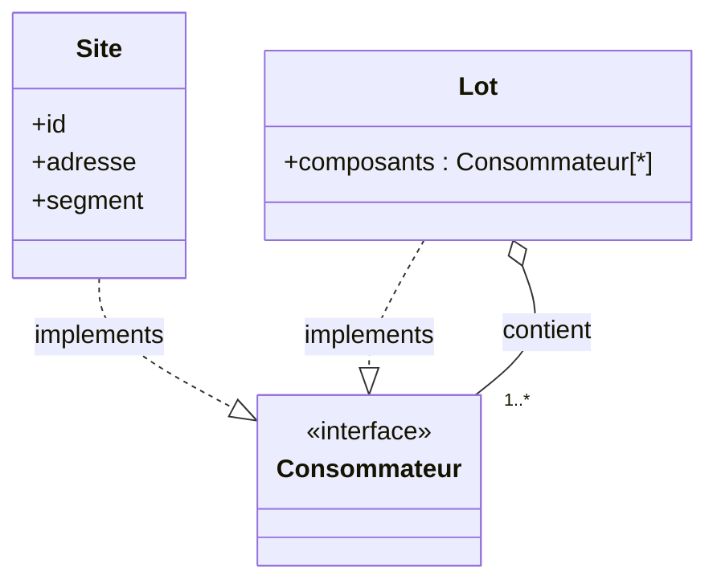

# Penser la modélisation à partir du réel : le cas des consommateurs d’électricité

## Introduction

En informatique, la modélisation des entités métier est une étape cruciale pour garantir la robustesse, l’évolutivité et la lisibilité d’un système. Encore faut-il que cette modélisation reflète fidèlement la réalité du domaine qu’elle représente.

Dans cet article, nous allons explorer un cas concret issu du domaine de l’énergie : la modélisation des **consommateurs d’électricité**. Ce sujet, en apparence simple, nous conduira à revisiter des concepts fondamentaux comme **l’héritage**, **la composition** et enfin le **pattern Composite**, tout cela en suivant un cheminement naturel d’évolution métier.

---

## 1. Définir le besoin métier

Modéliser un système de consommation d’énergie commence par une question simple : qu’est-ce qu’un consommateur ?

Dans un premier temps, on considère qu’un consommateur est caractérisé par :

* une adresse,
* un segment (permet de classer les consommateurs d’électricité),
* un identifiant unique : le PDL (Point De Livraison), spécifique à la distribution d’électricité en France.

Voici un premier modèle :

Ce modèle simple fonctionne tant que chaque entité a un seul point de livraison.

---

## 2. Une première évolution du besoin : regrouper plusieurs PDLs

Avec le temps, un nouveau besoin émerge : regrouper plusieurs PDLs sous une même entité. Cela permet, par exemple, de gérer un immeuble ou un ensemble de logements.

Notre premier réflexe a été de modifier le champ `pdl` pour en faire une liste :

Mais ce modèle atteint rapidement ses limites : tous les PDLs doivent alors appartenir au même segment, ce qui n’est pas toujours le cas.

---

## 3. Tentative avec l’héritage

Pour contourner ce problème, nous avons envisagé une hiérarchie d’objets :

* un **Site** représente un lieu de consommation unique,
* un **Lot** représente un regroupement de sites.

Mais cette modélisation est trompeuse. Une maison ne peut hériter d’un immeuble. Et un lot n’est pas une spécialisation d’un site. Cette relation d’héritage n’a pas de sens dans le monde réel.

---

## 4. Revenir à la réalité pour guider la modélisation

Plutôt que de forcer la logique technique, regardons ce que dit la réalité :

* Peut-on regrouper plusieurs maisons ? Oui, cela s’appelle un **lotissement**.
* Et si on les empile ? Cela devient un **immeuble**.

Ce qu’on cherche à modéliser, c’est donc une structure **composée de consommateurs**, où chaque entité (simple ou composée) reste un consommateur.

C’est exactement ce que permet le **pattern Composite**.

---

## 5. Le pattern Composite à la rescousse

Avec ce pattern, on introduit une abstraction `Consommateur` que peuvent implémenter :

* les entités simples comme `Site`,
* les entités composites comme `Lot`.

Chaque `Lot` peut contenir des `Sites`, mais aussi d’autres `Lots`. Le tout est considéré comme un `Consommateur`. Ainsi, notre système peut manipuler les entités simples et composées de façon uniforme.

---

## 6. Ce que l’on y gagne

* 📦 Une modélisation plus proche de la réalité
* 🔁 Une extensibilité naturelle du modèle
* 🧩 Une logique métier plus claire
* ✨ Un code plus simple et plus propre

---

## 7. Conclusion

En partant d’un besoin concret et en confrontant nos choix de modélisation à la réalité, on comprend vite que ni l’héritage, ni la simple composition ne suffisent toujours. Le pattern Composite apporte une solution élégante et cohérente pour représenter des structures hiérarchiques dans lesquelles les objets simples et composés doivent être traités de manière homogène.

Ce genre de cheminement est précieux : il montre que les patterns de conception ne sont pas juste des abstractions théoriques, mais des outils concrets pour modéliser intelligemment notre monde.
