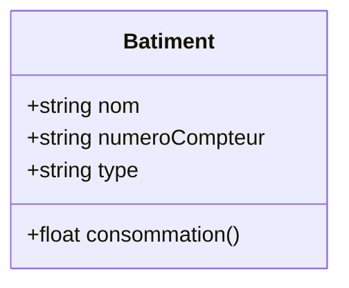
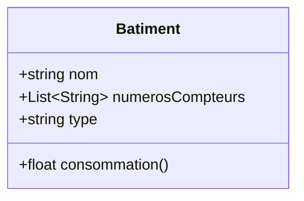
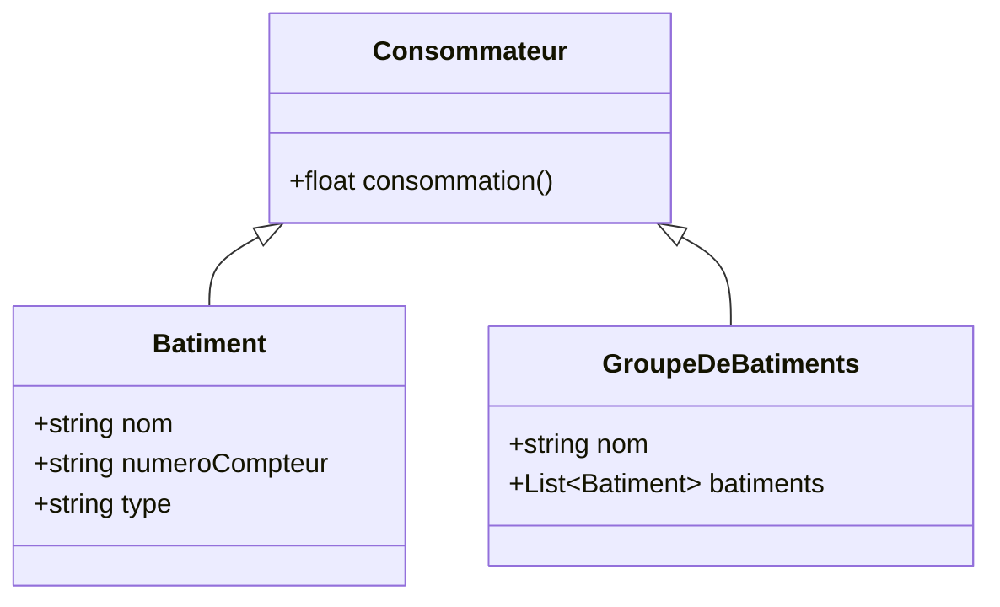
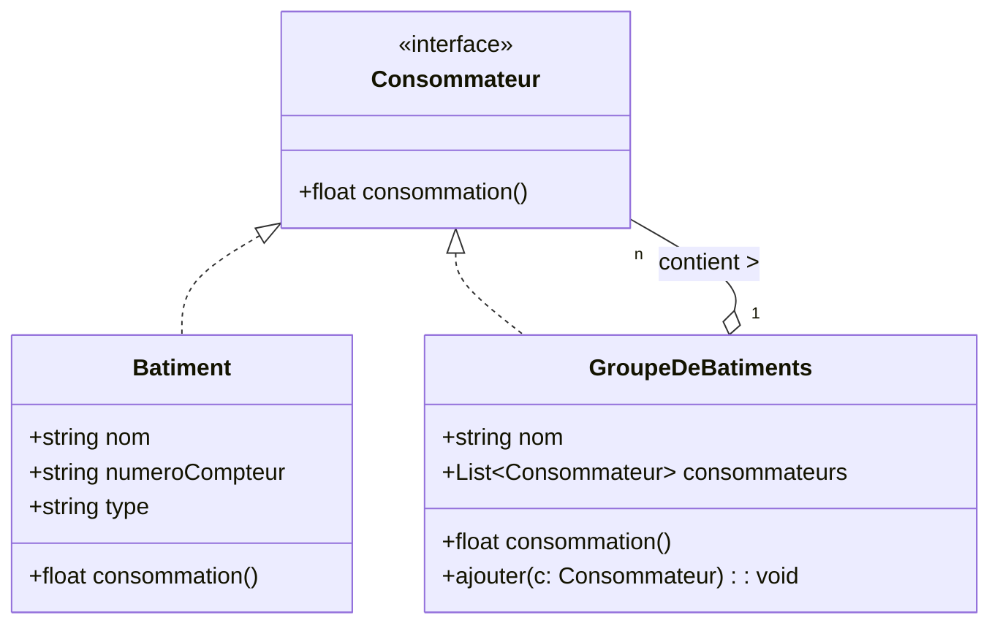

```mermaid
classDiagram
class Batiment {
+string nom
+string numeroCompteur
+string type
+float consommation()
}
```

```mermaid
classDiagram
class Batiment {
+string nom
+List~String~ numerosCompteurs
+string type
+float consommation()
}
```

```mermaid
classDiagram
class Consommateur {
    +float consommation()
}

class Batiment {
    +string nom
    +string numeroCompteur
    +string type
}

class GroupeDeBatiments {
    +string nom
    +List~Batiment~ batiments
}

Consommateur <|-- Batiment
Consommateur <|-- GroupeDeBatiments
```

```mermaid
classDiagram
class Consommateur {
    <<interface>>
    +float consommation()
}

class Batiment {
    +string nom
    +string numeroCompteur
    +string type
    +float consommation()
}

class GroupeDeBatiments {
    +string nom
    +List~Consommateur~ consommateurs
    +float consommation()
    +ajouter(c: Consommateur): void
}

Consommateur <|.. Batiment
Consommateur <|.. GroupeDeBatiments
GroupeDeBatiments "1" o-- "n" Consommateur : contient >
```

