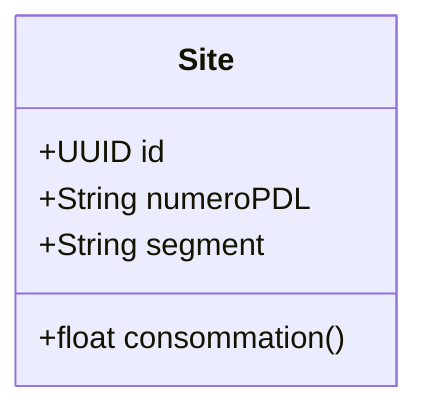

L'entité qui consomme de l'electricité se nomme un Site. C'est par exemple : une usine, un bâtiment, une maison...



Plusieurs sites

```mermaid
classDiagram
class Site {
    +UUID id
    +List~String~ numerosPDL
    +String segment
    +float consommation()
}
```mermaid

