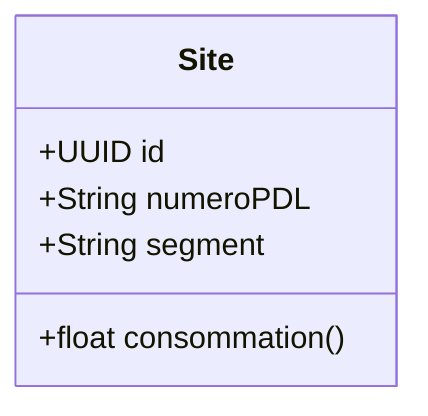
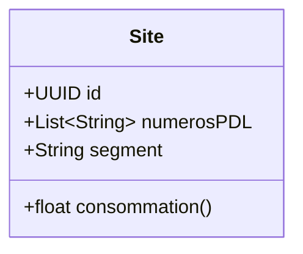
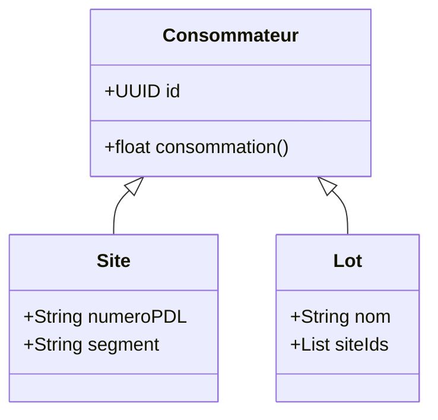

L'entité qui consomme de l'electricité se nomme un Site. C'est par exemple : une usine, un bâtiment, une maison...

```mermaid
classDiagram
class Site {
+UUID id
+String numeroPDL
+String segment
+float consommation()
}
```

Plusieurs sites

```mermaid
classDiagram
class Site {
    +UUID id
    +List~String~ numerosPDL
    +String segment
    +float consommation()
}
```

Héritage

```mermaid
classDiagram
    class Consommateur {
        +UUID id
        +float consommation()
    }

    class Site {
        +String numeroPDL
        +String segment
    }

    class Lot {
        +String nom
        +List<UUID> siteIds
    }

    Consommateur <|-- Site
    Consommateur <|-- Lot
```
