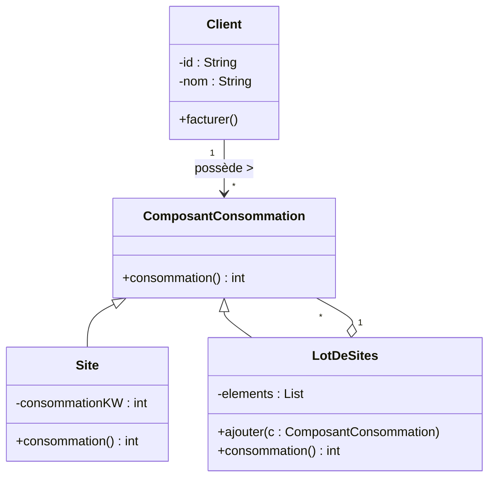

```mermaid
classDiagram
    class Client {
        -id : String
        -nom : String
        +facturer()
    }

    class ComposantConsommation {
        +consommation() int
    }

    class Site {
        -consommationKW : int
        +consommation() int
    }

    class LotDeSites {
        -elements : List<ComposantConsommation>
        +ajouter(c : ComposantConsommation)
        +consommation() int
    }

    Client "1" --> "*" ComposantConsommation : possède >

    ComposantConsommation <|-- Site
    ComposantConsommation <|-- LotDeSites
    LotDeSites "1" o-- "*" ComposantConsommation
```
